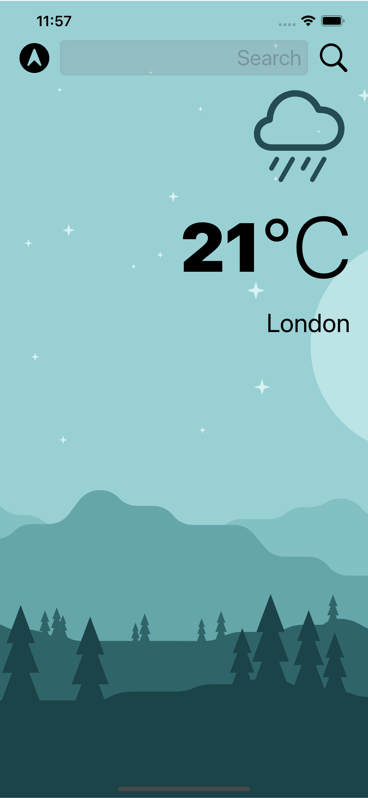
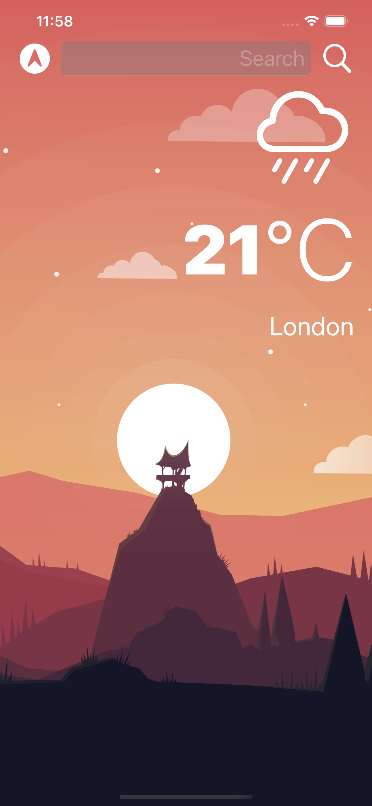

# Clima

This project is a challenge of the course IOS & Swift - The Complete IOS App Development Bootcamp

# Screen

<table>
  <tr>
    <td>
      
    </td>
    <td>
      
    </td>
  <tr>
</table>

## What you will learn

- How to create a dark-mode enabled app.
- How to use vector images as image assets.
- Learn to use the UITextField to get user input.
- Learn about the delegate pattern.
- Swift protocols and extensions.
- Swift guard keyword.
- Swift computed properties.
- Swift closures and completion handlers.
- Learn to use URLSession to network and make HTTP requests.
- Parse JSON with the native Encodable and Decodable protocols.
- Learn to use Grand Central Dispatch to fetch the main thread.
- Learn to use Core Location to get the current location from the phone GPS.
